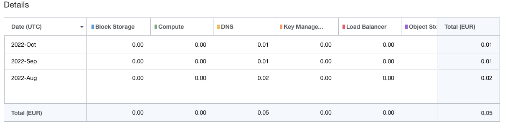

# ⎈ Oracle Cloud kubernetes free tier setup

This repo repository leverages Oracle Cloud's [always free tier](https://blogs.oracle.com/cloud-infrastructure/post/oracle-builds-out-their-portfolio-of-oracle-cloud-infrastructure-always-free-services) to provision a kubernetes cluster.
In its current setup, the only cost is a few cents for DNS management—though
you might be able to get that for free with Cloudflare.

Oracle Kubernetes Engine (OKE) is free to use, and you only pay for worker
nodes _if_ you exceed the Always Free tier — which we don’t.
The free tier provides **4 oCPUs and 24GB of memory**, which are split between two
worker nodes (`VM.Standard.A1.Flex`), allowing for efficient resource
utilization. Each node has a 100GB boot volume, with around 60GB available for
in-cluster storage via Longhorn. For ingress, we use `k8s.io/nginx` with Oracle’s
Flexible Load Balancer (10Mbps), which is also free.

Getting an Always Free account can sometimes be tricky, but there are several
guides on Reddit that explain how to speed up the creation process.

The initial infra setup is inspired by this great tutorial: https://arnoldgalovics.com/free-kubernetes-oracle-cloud/

> [!WARNING]
> This project uses arm instances, no x86 architecture, due to the limitations
> of the always free tier.

This repo hosts my personal stuff and is a playground for my kubernetes tooling.

> [!TIP]
> In case you want to reproduce another `oke` setup, you might [find this guide](https://github.com/piontec/free-oci-kubernetes)
> also helpful.

## :wrench: Tooling

- [x] K8s control plane
- [x] Worker Nodes
- [x] Ingress<br>
      nginx-ingress controller on a layer 7 lb
      teleport ingress on a layer 4 lb
- [x] Certmanager<br>
      with letsencrypt for dns & http challenge
- [x] External DNS<br>
      with sync to the cloudflare dns management
      CR to provide `A` records for my homenetwork
- [x] Dex as OIDC Provider<br>
      with github as idP
- [x] Flux for Gitops
- [x] Teleport for k8s cluster access
- [x] Storage<br>
      with longhorn (rook/ceph & piraeus didnt work out)
- [x] Grafana with Dex Login
- [ ] [kube-Prometheus/Alertmanager-stack](https://github.com/prometheus-community/helm-charts/blob/main/charts/kube-prometheus-stack/README.md)
      Dashboards for Flux, Teleport, Certmanager, ExternalDns
- [ ] [Prometheus Metrics Adapter](https://github.com/kubernetes-sigs/prometheus-adapter)
- [ ] Kyverno and Image Signing

## :keyboard: Setup
> [!Note]
> I've recently updated the `backend.s3` config, to work with terraform 1.6

This setup uses terraform to manage the oci **and** kubernetes part.

### Tooling on the client side

- terraform
- oci-binary

The terraform state is pushed to oracle object storage (free as well). For that
we have to create a bucket initially:

```
$ oci os bucket create --name terraform-states --versioning Enabled --compartment-id xxx
```

### 🏗️ Layout
* The infrastructure (everything to a usable k8s-api endpoint) is managed by
terrafom in [infra](infra/)
* The k8s-modules (OCI specific config for dns/secrets etc.) are managed by terraform in [config](config/)

These components are independed from eachother, but obv. the infra should
be created first.

For the config part, we need to add a private `*.tfvars` file:
```
compartment_id   = "ocid1.tenancy.zzz"
```

Running the `config` section you need more variables, which either get output
by the `infra`-run or have to be extracted from the webui.

As i've switched to flux, you also need a personal GH access token in there.

### Flux and External Secrets

As i'm opposed to store any secrets in git (encrypted or not), i rely on
external-secrets to propagate them to the cluster.

To generate an `Secret` with the auth information for the oracle vault, we've to run:

```
# inside infra
k --kubeconfig ~/.kube/oci.kubeconfig -n external-secrets create secret generic oracle-vault --from-literal=privateKey="$(terraform output --raw external_secrets_api_private_key)" --from-literal=fingerprint="$(terraform output --raw external_secrets_fingerprint)"

```
### kubeconfig

With the following command we get the kubeconfig for terraform/direct access:

```
# in the infra folder
oci ce cluster create-kubeconfig --cluster-id $(terraform output --raw k8s_cluster_id) --file ~/.kube/oci.kubeconfig --region eu-frankfurt-1 --token-version 2.0.0 --kube-endpoint PUBLIC_ENDPOINT
```

## Teleport
### Prerequisites
In it's current state, teleports want to setup a wildcard domain like `*.teleport.example.com`.
With OracleCloud managing my dns, this is not possible, as `cert-manager` is not
able, to do a `dns` challenge against orcale dns.
I've now switched to Cloudflare (also to mitigate costs of a few cents).


### Create local user

```
# follow the setup process in the browser
k --kubeconfig ~/.kube/oci.kubeconfig exec -n teleport -ti deployment/teleport-cluster-auth -- tctl users add nce --roles=access,editor,auditor

# login from the cli
tsh login --proxy teleport.nce.wtf:443 --auth=local --user nce teleport.nce.wtf
```

# Cost



## Upgrade

### OKE Upgrade 1.29.1

I mostly skipped `1.27.2` & `1.28.2` (on the workers) and went for the `1.29` release. As the UI didn't
prompt for a direct upgrade path of the control-plane, i upgraded the k8s-tf
version to the prompted next release, ran the upgrade, and continued with the next version.

The worker nodes remained at `1.26.7` during the oke upgrade, which worked because with 1.28
the new skey policy allows for worker nodes to be three versions behind.

### OKE Upgrade 1.25.4

:warning: remember to remove any `PSP`s first

1. Upgrade the nodepool & cluster version by setting the k8s variable; Run terrafrom (takes ~10min)
2. Drain/Cordon worker01
3. Go to the UI; delete the worker01 from the nodepool
4. Scale the Nodepool back to 2 (takes ~10min)
5. Wait for longhorn to sync (no volume in state `degraded`)
6. repeat for second node (2-5)

### OKE Upgrade 1.24

The 1.23.4 -> 1.24.1 Kubernetes Upgrade went pretty smooth, but by hand.

I followed the official guide:

- https://docs.oracle.com/en-us/iaas/Content/ContEng/Tasks/contengupgradingk8smasternode.htm
- https://docs.oracle.com/en-us/iaas/Content/ContEng/Tasks/contengupgradingk8sworkernode.htm

Longhorn synced all volumes after the new node got ready. No downtime experienced.
